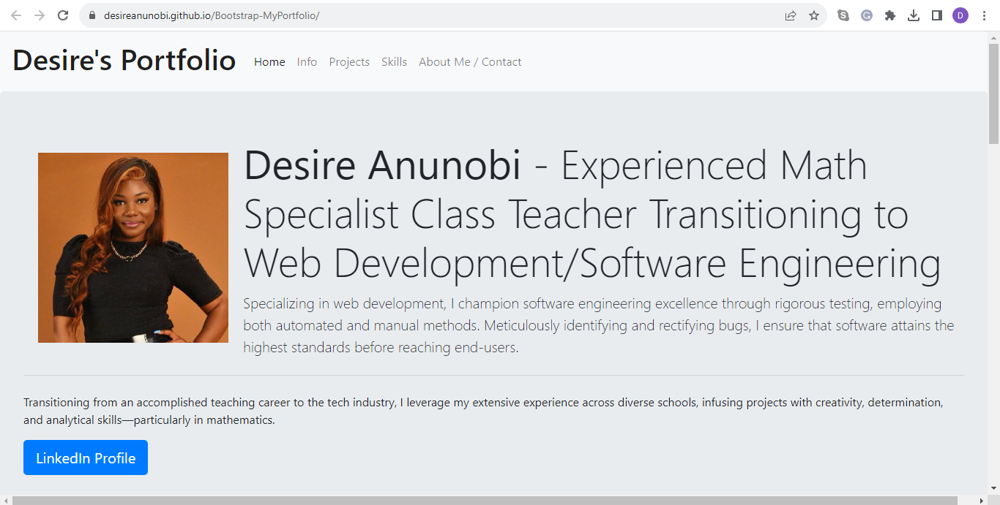

# Module 3 Challenge

## Description
This Module 3 Challenge was created for the Front-End Web Developer boot camp students. The website was built to teach and reinforce the basics of HTML, CSS, Bootstrap and Git. We used the Bootstrap CSS Framework to create a portfolio.

What I learnt?

I learnt more about how to effectively use Git Hub and Git Bash.
I learnt that commit messages are meant to be specific to improvement/changes made in code.
I learnt a ton of material: HTML, CSS, GitHub, GitHub Pages, and Bootstrap.

Link to the deployed application here:

https://desireanunobi.github.io/Bootstrap-MyPortfolio/

## Usage
This website was created to build my portfolio layout using the Bootstrap CSS Framework.

## Credits
https://www.udemy.com/course/the-complete-web-development-bootcamp/learn/lecture/37389818?start=39#overview 
https://getbootstrap.com/docs/5.3/getting-started/introduction/
https://www.w3schools.com/html/html_links.asp
https://www.w3schools.com/
https://pages.github.com/

## License
MIT License

Copyright © [2023] [Desire Anunobi]

Permission is hereby granted, free of charge, to any person obtaining a copy of this software and associated documentation files (the "Software"), to deal in the Software without restriction, including without limitation the rights to use, copy, modify, merge, publish, distribute, sublicense, and/or sell copies of the Software, and to permit persons to whom the Software is furnished to do so, subject to the following conditions:

The above copyright notice and this permission notice shall be included in all copies or substantial portions of the Software.

THE SOFTWARE IS PROVIDED "AS IS", WITHOUT WARRANTY OF ANY KIND, EXPRESS OR IMPLIED, INCLUDING BUT NOT LIMITED TO THE WARRANTIES OF MERCHANTABILITY, FITNESS FOR A PARTICULAR PURPOSE AND NONINFRINGEMENT. IN NO EVENT SHALL THE AUTHORS OR COPYRIGHT HOLDERS BE LIABLE FOR ANY CLAIM, DAMAGES OR OTHER LIABILITY, WHETHER IN AN ACTION OF CONTRACT, TORT OR OTHERWISE, ARISING FROM, OUT OF OR IN CONNECTION WITH THE SOFTWARE OR THE USE OR OTHER DEALINGS IN THE SOFTWARE.

